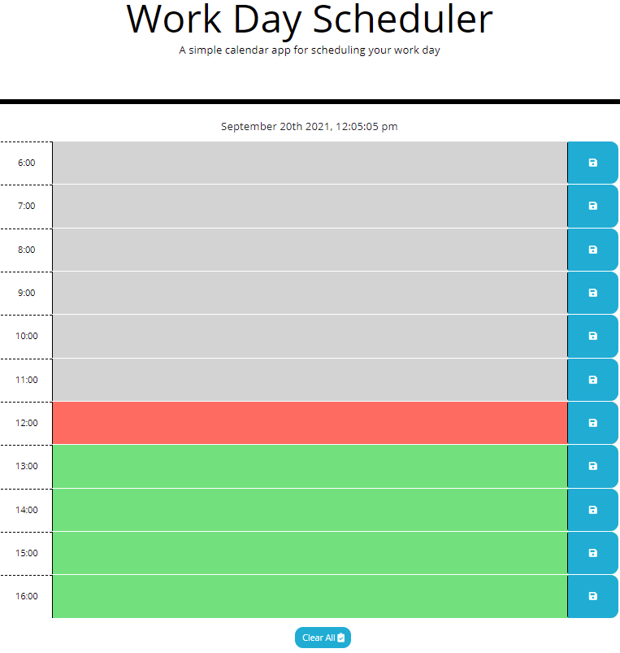
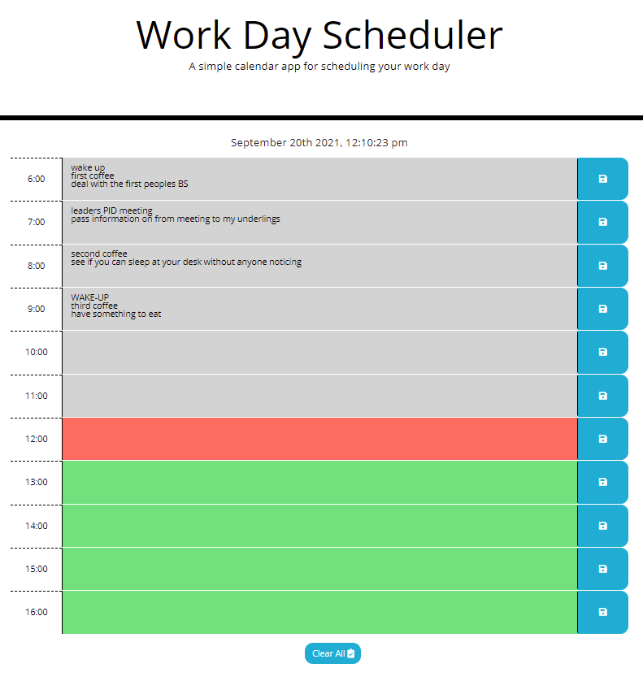
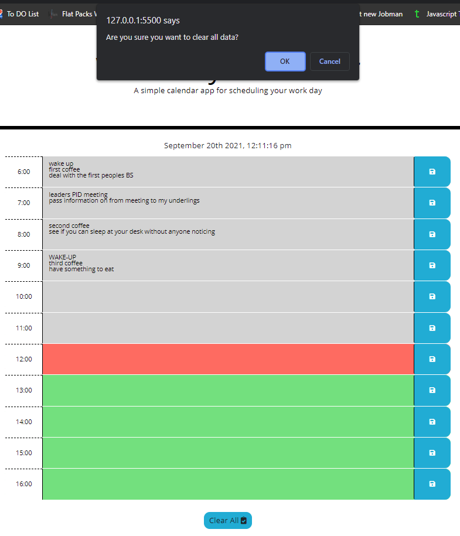

Week 5 homework Work Day Scheduler

As per the task given, I have made a simple calendar application that allows a user to save events for each hour of the day by modifying the starter code. 
It runs in the browser and features dynamically updated HTML and CSS powered by jQuery.

I have updated my code to save the information entered automatically.
There is also a clear all button at the bottom of the screen.

Default screen with no information entered zoom at 67% so you can see the whole screen

Some information entered

What will happen when the clear all button is clicked

